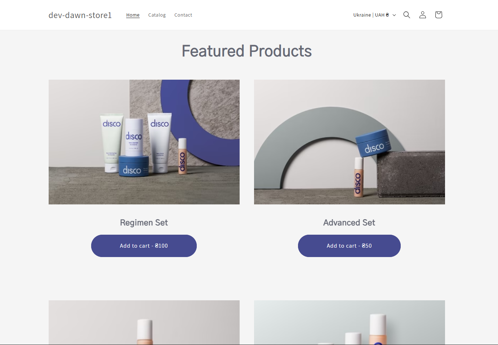
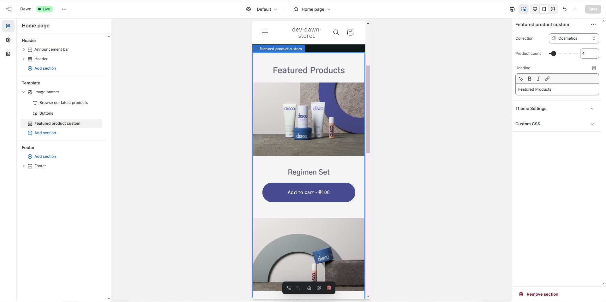

# 🎨 Shopify Theme - Featured Products Section

This repository contains a **Featured products custom** section for the standard Shopify **Dawn** theme. No build tools or dependencies were used to create the section.

### 1️⃣ Cloning a repository
First, bend the theme from GitHub:
```bash
git clone https://github.com/Kr1s10/shopify-test.git
cd shopify-test
```
### 2️⃣ Start a local development server
The first time you run the dev command, you're prompted to log in to Shopify. In Google Chrome, navigate to http://127.0.0.1:9292 to open the theme preview.
```bash
shopify theme dev --store {store-name}
```

### 3️⃣ Customization in the admin panel
To access the admin panel, you need to publish a topic in your store.
```bash
shopify theme push --store {store-name}
```

### Implemented functionality:
  * ability to change block title in admin panel
  * limit on the number of products in a block
  * Adding an item to the cart refreshes and shows the pop-up cart of the Dawn theme and does not reload the page
  * Adding a product to the cart updates the list of products in the section (since the added product is no longer displayed in the section)

> There is a more efficient approach to implementing shopping cart functionality with the addition of a custom form object and a custom shopping cart update module, but this would take more time than using existing components, so the quickest solution was chosen with a focus on reusing existing functionality in the theme.

### Screenshots:
  * section on site
  
  * in admin panel customize mode
  